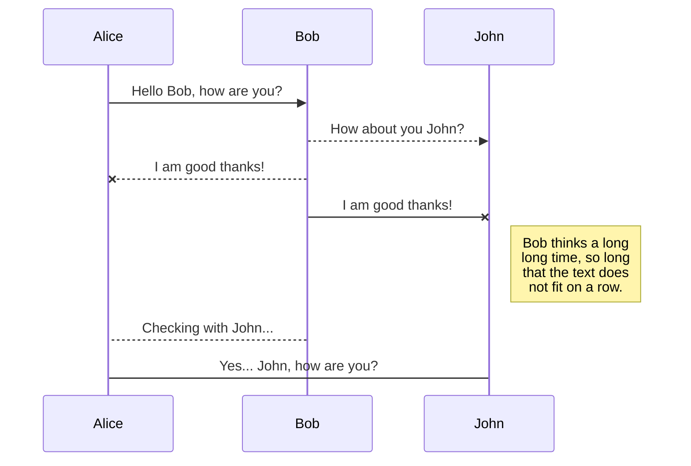
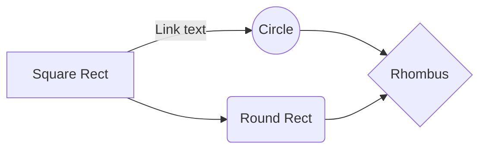

# Projet d'informatique PCC2A INSA Lyon
# On construit des ponts

Le projet est une simulation de pont. Voilà.

## Cadre du projet

Le projet a été réalisé par des étudiants en 2A à l'INSA Lyon dans le cadre du cours "Algorithme et Programmation S4". 
Le but de ce projet est de réaliser une application en JAVA implémentant une Interface Homme Machine. Le projet doit également courir un problème physique à modéliser. 

## Compilation et lancement du programme

The file explorer is accessible using the button in left corner of the navigation bar. You can create a new file by clicking the **New file** button in the file explorer. You can also create folders by clicking the **New folder** button.

## Structure du projet

All your files are listed in the file explorer. You can switch from one to another by clicking a file in the list.

## Auteurs

Le projet a été réalisé par des étudiants de 2A à l'INSA Lyon. 
Groupe 49. 
- BARDEZ Jean Baptiste  
- LE HUEC Benjamin
- PRATS Alban
- RAULT François
- THONIEL Solal

## License

Le projet est libre de droit. 
License GNUv3

## SmartyPants

SmartyPants converts ASCII punctuation characters into "smart" typographic punctuation HTML entities. For example:

|                |ASCII                          |HTML                         |
|----------------|-------------------------------|-----------------------------|
|Single backticks|`'Isn't this fun?'`            |'Isn't this fun?'            |
|Quotes          |`"Isn't this fun?"`            |"Isn't this fun?"            |
|Dashes          |`-- is en-dash, --- is em-dash`|-- is en-dash, --- is em-dash|

## KaTeX

You can render LaTeX mathematical expressions using [KaTeX](https://khan.github.io/KaTeX/):

The *Gamma function* satisfying $\Gamma(n) = (n-1)!\quad\forall n\in\mathbb N$ is via the Euler integral

$$
\Gamma(z) = \int_0^\infty t^{z-1}e^{-t}dt\,.
$$

> You can find more information about **LaTeX** mathematical expressions [here](http://meta.math.stackexchange.com/questions/5020/mathjax-basic-tutorial-and-quick-reference).

## UML diagrams

You can render UML diagrams using [Mermaid](https://mermaidjs.github.io/). For example, this will produce a sequence diagram:

And this will produce a flow chart:

